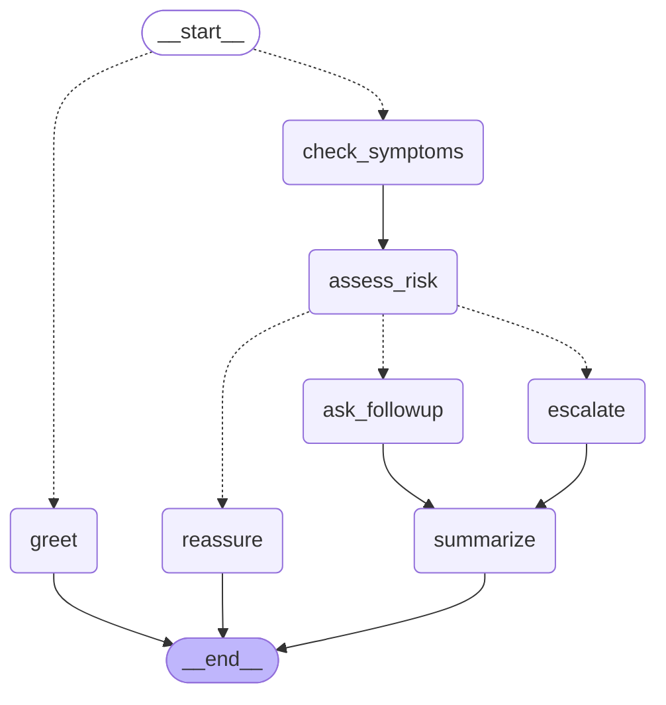

# Post-Discharge Follow-up Assistant
A conversational AI agent that follows up with recently discharged patients, grounded in a machine-learning hospital readmission risk model. Reported symptoms are combined with a per-patient risk score to decide whether to reassure, advise,
or escalate.

> ⚠️ Demonstration project. Not a medical device and not intended for clinical use.
 
**Live demo:** https://post-discharge-agent-yhuu7jups6jwzdhily85lj.streamlit.app
**Prediction API:** https://hospital-readmission-prediction-production.up.railway.app
(companion service — see [Architecture](#architecture))

## Overview / The Problem:
Hospital readmissions are costly and preventable. The first system predicts which patients are at risk within 30 days. But a prediction alone doesn't help the patient.
This assistant helps by providing conversational follow-up that acts on the risk score, triaging symptoms and guiding patients toward the right level of care.

## Architecture

## Key Design Decisions

### State machine over ReAct
The agent is built as an explicit `StateGraph` (LangGraph) rather than a prebuilt
ReAct agent:  
- **Deterministic routing.** Every patient follows the same path through the graph.
  A ReAct agent lets the LLM choose which tools to call and in what order, so two identical cases can take different routes.
- **Auditability.** In a clinical setting, the flow must be inspectable and
  reproducible. An explicit graph makes every transition traceable while a ReAct loop is opaque by comparison.
- **Safety.** A ReAct agent could skip the risk assessment entirely and reassure a patient reporting severe symptoms. The graph makes that path unreachable.
- **Custom state.** The state schema is modelled on the assistant's actual needs (symptoms, risk score, escalation level) instead of a generic message list.

### Risk score can only escalate
Risk is monotonic: any node may raise the patient's risk level, none may lower it.
If the LLM judges the reported symptoms to be mild but the readmission score is high, the high score wins. The reverse never happens.

### The agent consumes the prediction API, not the database
- The Readmission API owns the database and its schema.
- A direct database connection would break the assistant on any future schema change.
- The agent holds no database credentials, reducing its access surface.

> Deployment: the Readmission API runs on Railway, the assistant on Streamlit.

### Fail-safe on API failure
If the readmission risk score cannot be retrieved, the agent assumes maximum risk (100%) rather than proceeding without one. A missing score must never cause a high-risk case to be treated as routine — false alarms are cheap here, misses are not.  

## Tech Stack

| Category | Technology |
|---|---|
| AI Agent | LangGraph |
| API | FastAPI |
| Database | PostgreSQL, ChromaDB (RAG) |
| LLM | Claude (Anthropic API) |
| Frontend | Streamlit |
| Deployment | Streamlit Community Cloud, Railway |
| Language | Python |

## Features

- Sympton triage - interprets free-text patient messages describing how they feel after discharge
- 4-level severity routing — classifies each interaction in 4 different symptoms-severity levels ( none / advice / urgent / emergency) and acts accordingly
- Risk-aware escalation — combines the patient's readmission risk score with reported symptoms; high risk alone can trigger escalation even when symptoms are mild
- RAG-grounded responses — answers are grounded in clinical guidelines (ChromaDB), with a safety fallback when no relevant guideline is found
- Conversation summaries for clinicians — generates a concise, clinical-style summary of each conversation and stores it for the care team
- Bounded conversation - the conversation ends when the situation is clear ad remains open only when the Assistant needs further information